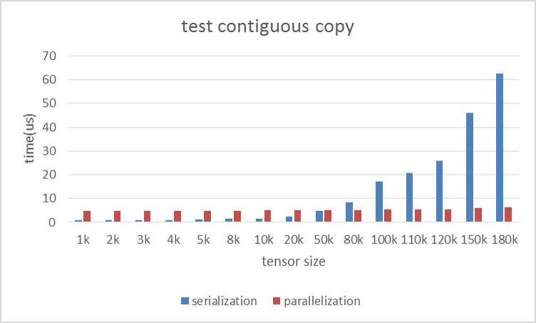
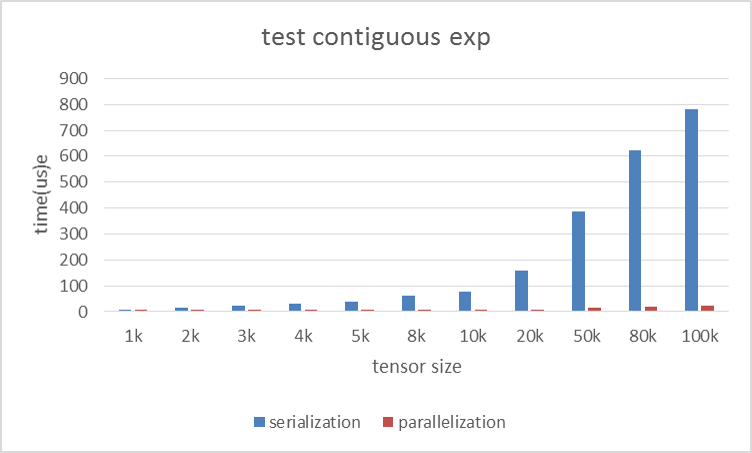
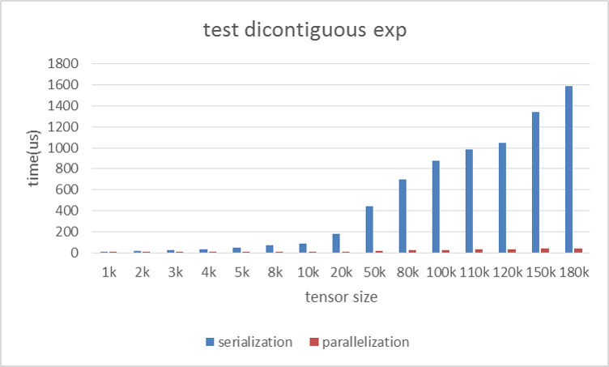

Pytorch element-wise operations optimization benchmark
=======

### 1. Abstract
Providing a benchmark for basic element-wise operations with or without optimization on different models of CPU. Benchmark data of copy, add, div, exp and sin operation is available now.   

Some general conclusions from this benchmark:  

- The OpenMP overhead threshold of official version is too high to help small and medium size tensors benefit from OpenMP parallelism.
-	No matter tensors are contiguous or not, most operations can be boosted by OpenMP.
-	The optimal OpenMP overhead threshold is dependent on the specific operation and the CPU model. This benchmark gives a rough estimation of OpenMP overhead threshold of copy, add, div, exp and sin operation on different models of CPU. We even set the value to 720 in our previous case for OpenNMT and gain good performance.  


### 2. Our main work
- Parallel many operations of discontinuous tensors by using multi-threads  
Slice operation of tensor is very common in science computation. Using slice operation will generate discontinuous tensor. Meanwhile, [__Official Pytorch__](https://github.com/pytorch/pytorch) does not support parallelism for discontinuous tensor for the moment. The beta development branch of Intel version is [__dev-omp2__](https://github.com/intel/pytorch/tree/dev-omp2). We are also engaging to contribute our work to official Pytorch, the corresponding branch is [__dev-omp__](https://github.com/intel/pytorch/tree/dev-omp).  
-	Try to find suitable OpenMP overhead threshold to maximize the effectiveness of multi-thread programming
Official Pytorch set the OpenMP overhead threshold to 100K, we benchmarked copy, add, div, exp, sin operation in both contiguous and discontinuous cases on different CPU models to show that this threshold is too high. We also give a rough estimation of OpenMP overhead threshold in these cases.

  
### 3. Installation and test
#### 3.1 Installation
##### Official Pytorch   
Please refer to official [__link__](https://github.com/pytorch/pytorch)  
##### Intel Pytorch 
The installation manual is mainly modified from official pytorch. What you should be care of is that the branch is __dev-omp2__.  

To get a high quality BLAS library (MKL) and a convenient package manager conda, we highly recommend you to install [Anaconda](https://www.continuum.io/downloads) environment. 

Once you have [Anaconda](https://www.continuum.io/downloads) installed, you can follow the instructions below:

If you want to develop with different pytorch versions at the same time, you may need to create several python virtual environments. Here are the instructions.
```bash
conda install virtualenv  
virtualenv [your-env-name]
```
After creating the virtual environment, you can activate it by typing
```bash
source your-env-path/bin/activate
```
If this is done successfully, you could see the virtual environment name in the front of your command line.  
Now you can install pytorch in this virtual environment without interfering with others. To switch between different virtual environments, you can follow this.
```bash
deactivate ---to exit an environment
source your-env-path/bin/activate ---to enter an environment
```
Download intel pytorch source code.
```bash
git clone --recursive -b dev-omp2 https://github.com/intel/pytorch.git
```
Before installing, you should disable the CUDA support, and set the CMAKE_PREFIX_PATH.
```
export NO_CUDA=1
export CMAKE_PREFIX_PATH="$(dirname $(which conda))/../" # [anaconda root directory]
```
Install intel Pytorch
```
python setup.py install
```


#### 3.2 Test

You can get the performance data by using the format of command below after activating your corresponding pytorch. You must be aware of which pytorch you are using.
```bash
python benchmark.py <benchmark num> <output file name> 
```
where `benchmark num` is an integer among `1, 2`, set it to `1` for benchmark in section 4.1, to `2` for benchmark in section 4.2.  


### 4. The benchmark result
We will release the benchmark on a desktop CPU, and server CPU. The specific model is below here.

|Cores|CPU Model|Frequency|
|---|---|---|
|44  |Intel(R) Xeon(R) CPU E5-2699 v4    | 2.20GHz
|56  |Intel(R) Xeon(R) Platinum 8180 CPU | 2.50GHz

The data we achieved for now is from the server CPU. The data may fluctuate a little in a same CPU because of the complex environment.

#### 4.1 OpenMP overhead threshold of official Pytorch is too high
We choose add, exp operation for contiguous tensors that are smaller than 100K and larger than 800 as the test case. We compiled two versions of official Pytorch, which only differs in the OpenMP overhead threshold. In the first version we set the threshold to 100K,  so all test case we choose will run serially.  In the second version we set the threshold to 800, so all test case we choose will run serially. 

Platform: Platinum 8180
Operation: add
Tensor Continuity: contiguous  
Unit: microsecond  

Time cost result is below:  

|Tensor Size|serialize|parallelize|SpeedUp|
|---|---:|---:|---:|
|1k	|1.04	|5.15|		0.20X      |
|2k	|1.23	|5.47|		0.22X      |
|3k	|1.33	|5.34|		0.24X      |
|4k	|1.47	|5.41|		0.27X      |
|5k	|1.48	|5.40|		0.27X      |
|8k	|1.81	|5.55|		0.32X      |
|10k|1.98	|5.66|		0.35X      |
|20k|2.74	|6.74|		0.40X      |
|50k|5.12	|6.59|		0.77X      |
|80k|14.79	|6.59|		2.24X      |
|100k|21.97	|6.70|		3.27X      |



Conclusion: Setting the threshold to 80K is good for add operation. 

Platform: Platinum 8180
Operation: exp
Tensor Continuity: contiguous  
Unit: microsecond  

Time cost result is below:  

|Tensor Size|serialize|parallelize|SpeedUp|
|---|---:|---:|---:|
|1k	|9.48	|5.66|		1.67X      |
|2k	|17.00	|6.35|		2.67X      |
|3k	|24.82	|6.03|		4.11X      |
|4k	|32.52	|6.28|		5.17X      |
|5k	|40.33	|6.27|		6.42X      |
|8k	|63.58	|7.04|		9.02X      |
|10k|79.13	|7.61|		10.38X      |
|20k|156.78	|9.11|		17.20X      |
|50k|387.85	|15.07|		25.73X      |
|80k|623.34 |20.23|		30.80X      |
|100k|779.95|23.57|		33.08X      |



Conclusion: Setting the threshold to 1K is good for exponential operation.
If you are familar of pytorch or torch [code](https://github.com/pytorch/pytorch/blob/master/torch/lib/TH/vector/AVX.c#L13-L16) and SIMD(2x256bit = 8x64bit = 8xsizeof(double)), you will know 2k may be OK if not using SIMD. It will be verified in next section.

From above results, it is easy to understand that,

- Different operations have their own optimal OpenMP overhead threshold, but 100K is never suitable.
- OpenMP overhead threshold for specific operation goes low as the operation consumes more time.
  
We don't list the detailed data for div and sin operation but provide a rough estimation of OpenMP overhead threshold for different operations.

Platform: Platinum 8180
|Operation|OpenMP overhead threshold|
|---|---:|
|contiguous copy|80K|
|contiguous add |80K|
|contiguous div	|50K|
|contiguous exp	|1k	|
|contiguous sin	|1k | 

#### 4.2 openmp can speedup most of discontinuous tensor operations
We choose add and exp operation for discontinuous tensors that are in the range of 1K to 180K as the test case. Official pytorch does not optimize operations for discontinuous tensors with OpenMP but Intel version does. To justify OpenMP also do good in discontinuous tensor operations and find a suitable overhead threshold, we compiled two versions of Pytorch. One is the Official Pytorch with OpenMP overhead threshold set to 800. This overhead threshold has no effect in discontinuous tensor operation, but we set it just to control different variables between Official version and Intel version. The other is the Intel version Pytorch with OpenMP overhead threshold set to 800. We set the threshold to a low value to find the critical point that parallel version exceeds serial one. 

Platform: Platinum 8180
Operation: add
Tensor Continuity: discontinuous  
Unit: microsecond 

Time cost result is below:  

|Tensor Size|serialize|parallelize|SpeedUp|
|---|---:|---:|---:|
|1k|	1.69    |	6.98	|	0.24X |
|2k|	2.42    |	7.47	|	0.32X |
|3k|	3.12 	|	7.38 	|	0.42X |
|4k|	3.77  	|	7.43  	|	0.50X |
|5k|	4.46 	|	7.47	|	0.59X |
|8k|	6.44 	|	7.49	|	0.85X |
|10k|	7.82 	|	7.69	|	1.01X |
|20k|	14.54	|   7.80	|   1.86X |
|50k|	34.35 	|	8.31 	|	4.13X |
|80k|	54.80 	|	8.68 	|	6.31X |
|100k|	68.82 	|	9.07 	|	7.58X |
|110k|  75.92	|   8.99	|   8.43X |
|120k|  83.03	|   9.52	|   8.71X |
|150k|  104.24	|   9.92	|   10.50X|
|180k|  124.28	|   10.68	|   11.62X|


Conclusion: Setting the threshold to 10K is good. 
   
Platform: Platinum 8180
Operation: exp  
Tensor Continuity: discontiguous  
Unit: microsecond  

Time cost result is below:  

|Tensor Size|serialize|parallelize|SpeedUp|
|---|---:|---:|---:|
|1k	|10.02	    |7.27	|	1.37X|
|2k	|19.01    	|7.83   |	2.42X|
|3k	|27.73   	|7.48   |	3.70X|
|4k	|36.45		|7.66	|	4.75X|
|5k	|45.26		|8.13	|	5.56X|
|8k	|71.36		|8.70	|	8.19X|
|10k|88.75		|9.15   |	9.69X|
|20k|176.26		|11.32  |	15.56X|
|50k|439.68		|19.07	|	23.04X|
|80k|700.40		|26.99	|	25.94X|
|100k|876.42	|27.61 	|	31.73X|
|110k|983.76	|29.79	|	33.01X|
|120k|1050.07	|31.87	|	32.94X|
|150k|1341.23	|37.59	|	35.67X|
|180k|1584.88	|43.27	|	36.62X|


Conclusion: Setting the threshold to 1K is good. 

From above results, besides conclusions draw from continuous tensor operations, we also know that, 

- Discontinuous operation can be improved a lot using OpenMP optimization.
- OpenMP overhead threshold of discontinuous tensor usually lower than that of continuous tensor because discontinuous tensor operations consume more time than continuous tensor operations.
  
We don't list the detailed data for div and sin operation but provide a rough estimation of OpenMP overhead threshold for different operations.

Platform: Platinum 8180
|Operation|OpenMP overhead threshold|
|---|---:|
|discontinuous copy	|20K|
|discontinuous add 	|20K|	
|discontinuous div	|10K|
|discontinuous exp	|1k	|
|discontinuous sin	|2k | 

###4. Conclusions
- Different operations have their own optimal OpenMP overhead threshold, but 100K is never suitable.
- OpenMP overhead threshold for specific operation goes low as the operation consumes more time.
- Discontinuous operation can be improved a lot using OpenMP optimization.
- OpenMP overhead threshold of discontinuous tensor usually lower than that of continuous tensor because discontinuous tensor operations consume more time than continuous tensor operations.
- All benchmark data are available in /benchmark-data.
